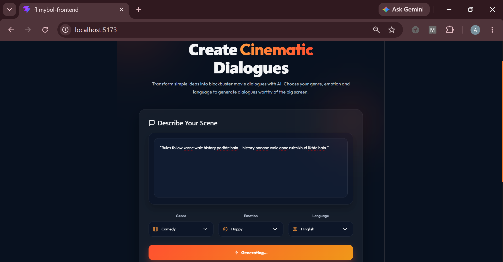
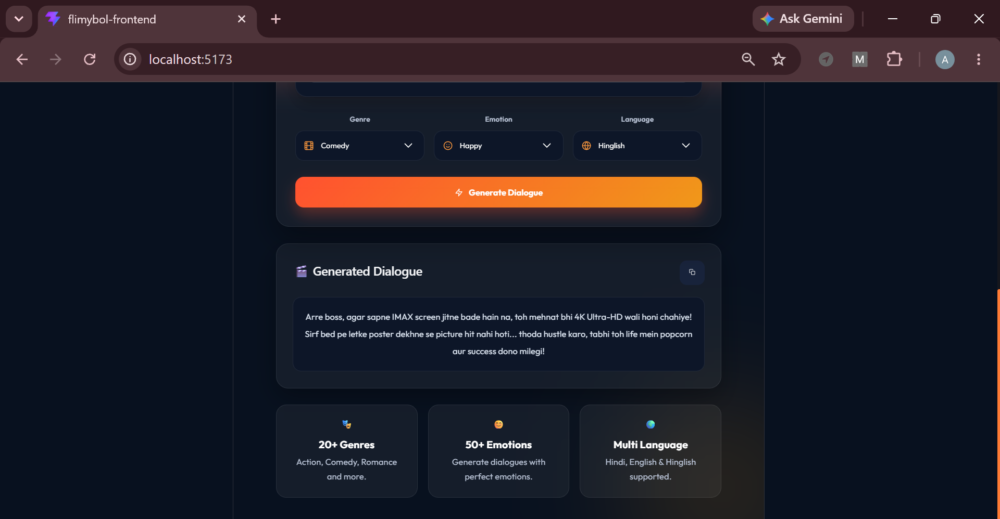

# 🎬 FilmyBol AI

An AI-powered movie dialogue generator that transforms simple scene descriptions into cinematic dialogues. Users can select a **Genre**, **Emotion**, and **Language**, and instantly generate engaging movie-style dialogues using **Google Gemini AI**.

---

## 📸 Preview

<p align="center">
  
  
</p>

---

## ✨ Features

- 🎬 AI-powered movie dialogue generation
- 🎭 Multiple movie genres
- 😊 Emotion-based dialogue generation
- 🌍 Supports Hindi, English & Hinglish
- ⚡ Fast response using Gemini AI
- 📋 One-click copy generated dialogue
- 🎨 Premium responsive UI
- 🔥 Modern glassmorphism design

---

## 🛠️ Tech Stack

### Frontend
- React.js
- Vite
- CSS3
- Axios
- React Icons

### Backend
- Spring Boot
- Java
- REST API

### AI
- Google Gemini API

---

## 📂 Project Structure

```text
FilmyBol/
│── src/
│   ├── App.jsx
│   ├── App.css
│   ├── main.jsx
│── public/
│── dashboard.png
│── package.json
│── README.md
```

---

## 🚀 Getting Started

### Clone the Repository

```bash
git clone https://github.com/https://github.com/Anjali28-ish/FilmyBol.git
```

### Navigate to the Project

```bash
cd FilmyBol
```

### Install Dependencies

```bash
npm install
```

### Run the Frontend

```bash
npm run dev
```

---

## ⚙️ Backend Configuration

Make sure the Spring Boot backend is running on:

```text
http://localhost:8080
```

API Endpoint:

```text
POST /api/chat
```

---

## 📥 Sample Request

```json
{
  "sentence": "Sapne bade rakho... mehnat unse bhi badi.",
  "genre": "Comedy",
  "emotion": "Happy",
  "language": "Hinglish"
}
```

---

## 🚀 How It Works

1. Enter a movie scene or sentence.
2. Select your preferred genre.
3. Choose the desired emotion.
4. Select the output language.
5. Click **Generate Dialogue**.
6. Receive an AI-generated cinematic dialogue instantly.

---

## 🤝 Contributing

Contributions are always welcome.

1. Fork the repository.
2. Create your feature branch.
3. Commit your changes.
4. Push to your branch.
5. Open a Pull Request.

---


## 👨‍💻 Author

Anjali Kumari

Built with ❤️ using **React.js**, **Spring Boot**, and **Google Gemini AI**.
